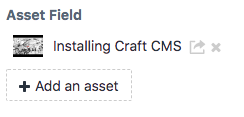

# Embedded Assets Link plugin for Craft CMS 3.x

Adds a link in the Control Panel to [Embedded Assets](https://plugins.craftcms.com/embeddedassets)

## Requirements

This plugin requires Craft CMS 3.0.0-beta.23 or later, and the Embedded Assets Plugin.

## Installation

To install the plugin, follow these instructions.

1. Open your terminal and go to your Craft project:

        cd /path/to/project

2. Then tell Composer to load the plugin:

        composer require marionnewlevant/embedded-assets-link

3. In the Control Panel, go to Settings → Plugins and click the “Install” button for Embedded Assets Link.

Brought to you by [Marion Newlevant](http://marion.newlevant.com)

Inspired in part by the [Download Assets](https://plugins.craftcms.com/download-assets) plugin.

Icon: export by Nociconist from the Noun Project
